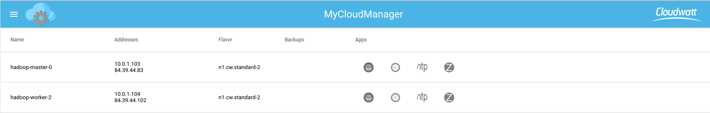

# Instrumentaliser un cluster Hadoop avec MyCloudManager

 

## Lancement des Stacks

Ce tutoriel à pour but de vous montrer comment Instrumentaliser votre cluster hadoop avec la stack MyCloudManager.

Pour commencer assurez vous d'avoir lancé les stacks dans votre tenant, si ce n'est pas le cas, je vous invite à regarder les articles suivant :

* Demarrer MyCloudManager : http://dev.cloudwatt.com/fr/blog/innovation-beta-mycloudmanager-v2.html

* Demarrer un cluster Hadoop : http://dev.cloudwatt.com/fr/blog/deployer-votre-service-hadoop-as-a-service-au-travers-d-un-stack-heat.html

## Demarrer l'instrumentalisation

Pour pouvoir déployer les applications MyCloudManager, il faut que celui-ci puisse communiquer avec les instances et donc que celle-ci soit attachées au même réseau que votre stack MyCloudManager.

Dans le cadre du déploiement du cluster hadoop, il nous ai possible de choisir le réseau sur lequel celui-ci sera déployé. Voici la procédure :

* Connectez vous à l'interface web de votre stack hadoop via la flotting-ip donné en sortie de votre stack ainsi que vos indentifiants Cloudwatt,

* Vérifier que vous vous trouvez bien sur le tenant où vous avez crée MyCloudManager ainsi que la region, dans cet exemple : tenant = `0750177966_@_1449053663`, region= `FR1`

* Commencer la création de votre cluster, rendez-vous dans la partie `Data Processing` puis `Clusters` de votre console Hadoop puis cliquez sur `Launch Cluster`, choisissez à présent le type de cluster ainsi que la version, dans cet exemple : plugin `Vanilla` version 2.7.1

* Sur le deuxième volet renseignez les paramètres que vous souhaitez donner à votre cluster, et surtout dans la partie `Neutron Management Network` renseignez ici le réseau de votre MyCloudManager puis démarrez la création,

* Une fois votre cluster créé vous pouvez maintenant vous connecter en *ssh* sur l'ensemble des instances qui le compose et copier la commande `curl` qui vous est donnée lors de l'ajout d'une instance dans MyCloudManager,

* Apres avoir attaché les instances, vous pouvez à présent lancer le déployement des applications comme expliqué dans l'article MyCloudManager,

  http://dev.cloudwatt.com/fr/blog/innovation-beta-mycloudmanager-v2.html

---
Have Fun and Hack in Peace
